# Sabasaba_simul.java  
* ### 프로젝트 기간  
2018.04 ~ 2018.06.06   

개요
----------------
__성적을 잘 받기 위해 교수님께 사바사바하는 시뮬레이션 게임__  

* 플레이어 : 대학생  
* 게임설정 : 시험기간  
* 공략대상 : 교수님 

플레이어가 대학생 입장으로 플레이하면서 게임의 상황에 공감할 수 있고 풍자를 느끼기 위해 선정한 주제이다. 또한 재미난 주제로 쉽게 몰입할 수 있도록 게임, 시뮬레이션 등 조원들의 아이디어를 종합한 결과다.  

모티브는 미소녀 연예 시뮬레이션 게임. 즉, 여주인공과의 대화가 이어지면서 결정하는 선택지에 따라 주인공에 대한 그의 호감도가 누적되며, 최종 호감도에 따라 지정된 엔딩이 나오는 게임을 기반으로 했다.  

여기에 플레이어가 대학생이라는 설정을 추가해, 시험을 앞둔 철부지 학생이 세 명의 교수님과 대화하면서 호감도를 높이고, 누적된 호감도가 시험성적을 좌우하도록 계획했다.  

기존의 연예 시뮬레이션 게임의 진행 형태와 달리 시간표라는 임의로 지정된 순서에 따라 게임이 진행되며 중간에 세부 게임요소들이 추가된다. 설정의 몰입을 위해 시간표, 공강, 술내기, 벼락치기 등의 게임 요소들을 추가했다.  

주제 구현 방향
---------------

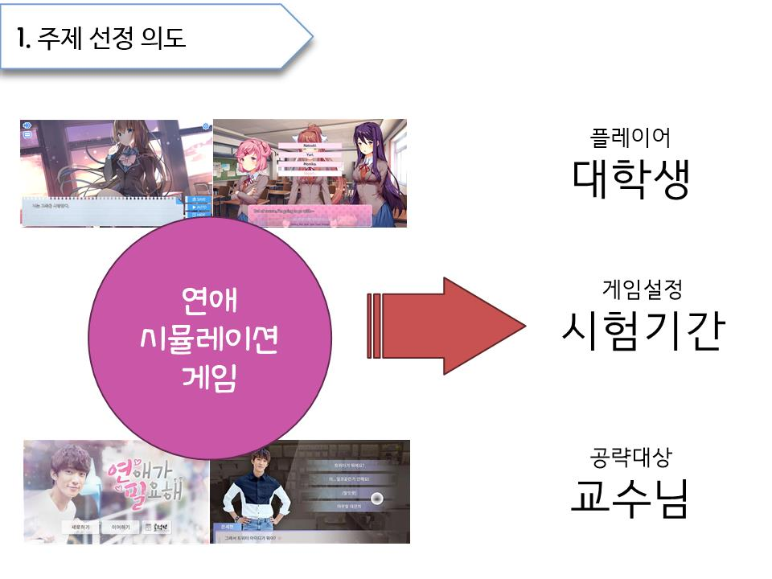  
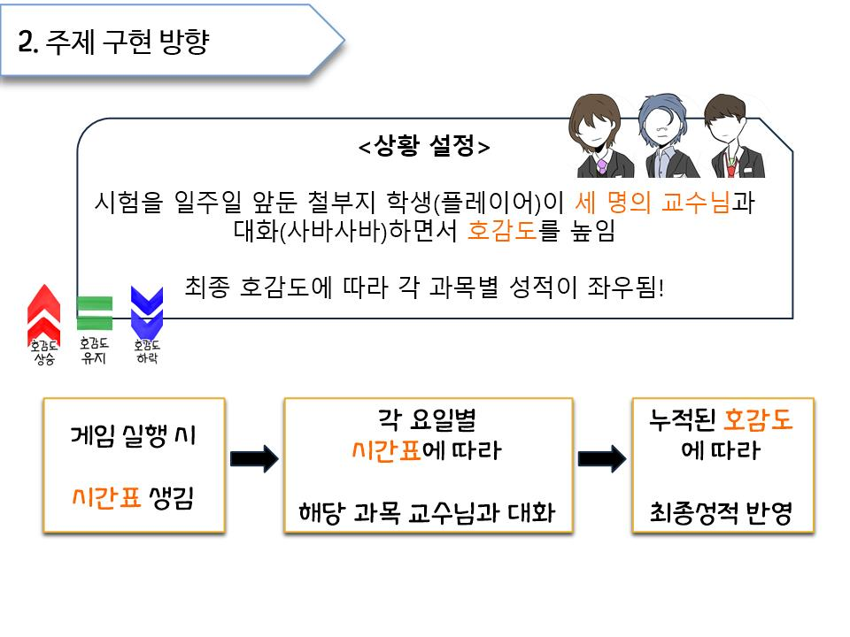  
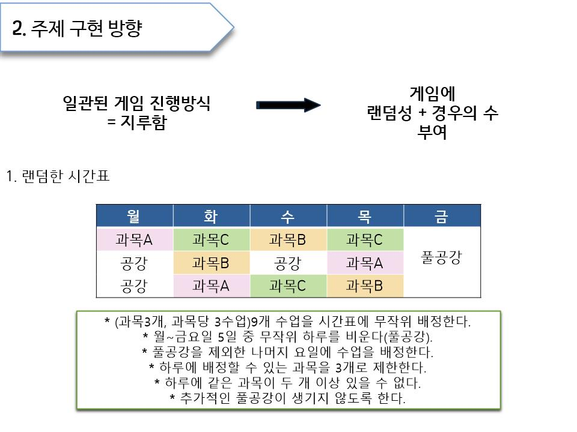  
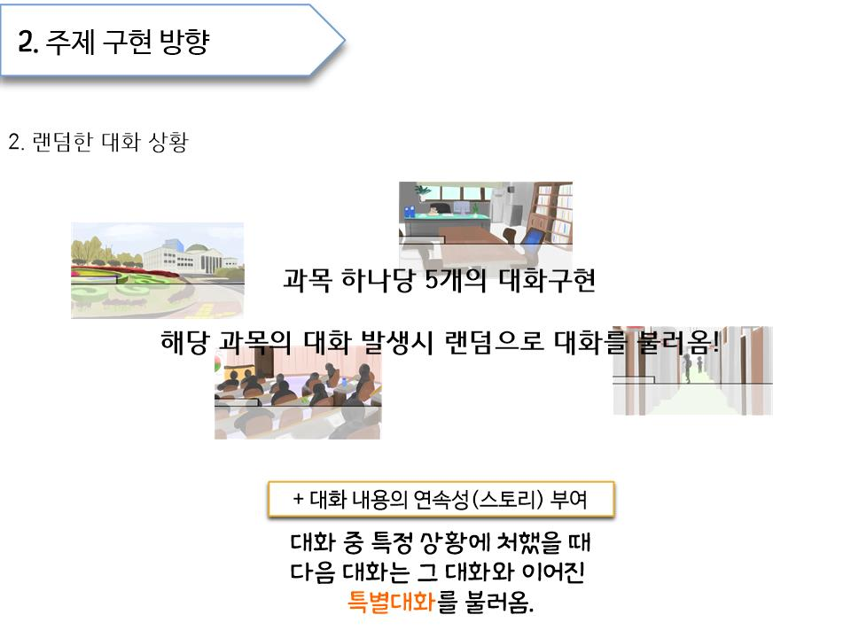  
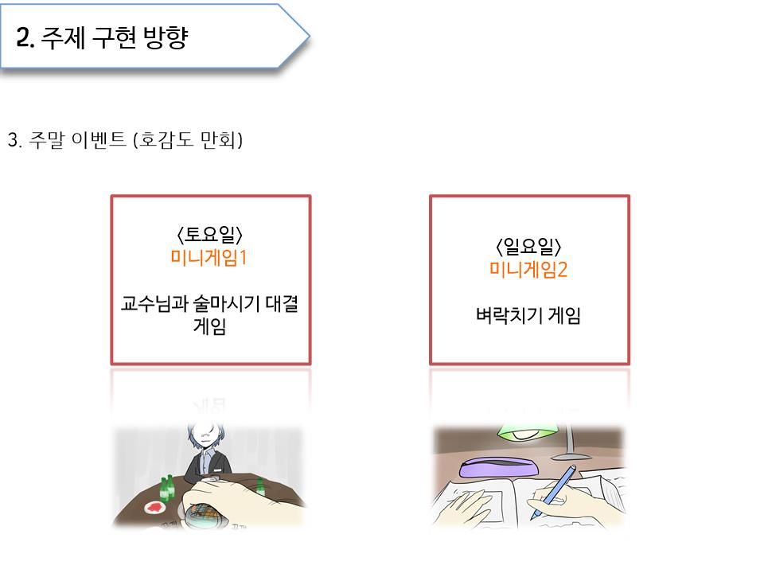  
  
  
구현한 기능 및 클래스
----------------
|  클래스명 | 기능 설명 |
|---|---|
|  GoodFeeling |  세 교수님의 호감도를 정의하고 각 호감도의 상승, 유지, 하락 기능을 수행한다. |
|  A_Normal_1 | 교수님A의 <일반 대화1>을 진행한다. |
|  A_Normal_2 | 교수님A의 <일반 대화2>을 진행한다. |
|  A_Normal_3 | 교수님A의 <일반 대화3>을 진행한다. |
|  A_Special | 교수님A의 <특별 대화>을 진행한다. (이전 대화에서 조건 만족 시 발생) |
|  A_Holiday |  교수님A의 <휴일 대화>을 진행한다. (하루 중 수업이 없는 날에만 발생) |
|  B_Normal_1 | 교수님B의 <일반 대화1>을 진행한다.*  |
|  B_Normal_2 | 교수님B의 <일반 대화2>을 진행한다.*  |
|  B_Normal_3 | 교수님B의 <일반 대화3>을 진행한다.*  |
|  B_Special | 교수님B의 <특별 대화>을 진행한다. (이전 대화에서 조건 만족 시 발생)*  |
|  B_Holiday |  교수님B의 <휴일 대화>을 진행한다. (하루 중 수업이 없는 날에만 발생)* |
|  C_Normal_1 | 교수님C의 <일반 대화1>을 진행한다.*  |
|  C_Normal_2 | 교수님C의 <일반 대화2>을 진행한다.*  |
|  C_Normal_3 | 교수님C의 <일반 대화3>을 진행한다.*  |
|  C_Special |  교수님C의 <특별 대화>을 진행한다. (이전 대화에서 조건 만족 시 발생)* |
|  C_Holiday | 교수님C의 <휴일 대화>을 진행한다. (하루 중 수업이 없는 날에만 발생)*  |
|  Music | 시작 화면에서 음악을 재생하도록 한다.*  |
|  Simul_start | 시작화면을 진행한다. 플레이어의 이름을 입력받고 게임방법과 상황을 설명한다.  |
|  TimeTable |  시간표를 무작위로 배정한다. (배정 조건 있음) |
|  Dialogue_A | 조건에 따라 교수님A의 대화들 중 하나를 불러온다.  |
|  Dialogue_B | 조건에 따라 교수님B의 대화들 중 하나를 불러온다.  |
|  Dialogue_C | 조건에 따라 교수님C의 대화들 중 하나를 불러온다.  |
|  MainFrame | 게임 창을 구현한다.  |
|  ProfessorDialogue |  각 교수님의 대사가 담긴 txt파일을 문자열 형태로 불러온다.* |
|  Work | 대화 또는 이벤트가 완전히 끝날 때 까지 다음 대화가 실행되지 못하도록 한다.  |
|  Main |  main 메소드가 있는 클래스. |
|  DrinkingGame | 미니게임 1. 교수님과 술 마시는 게임. (토요일에 진행) |
|  TryNotToSleep | 미니게임 2. 벼락치기 하는 게임. (일요일에 진행) |
|  GameResult | 플레이어의 이름과 각 교수님의 최종 호감도를 반환받아 최종 성적을 표시한다.  |
|  PlayByTimeTable | 배정된 시간표에 따라 대화 또는 이벤트를 진행한다.  |  

' * ' 표시는 File 클래스 기능을 수행했음을 뜻함.

추가로 구현한 클래스 & 기능
-------------
|  클래스명 | 기능 설명 |
|---|---|
| TryNotToSleep_Play | 미니게임 2를 실행 및 진행하고 결과를 보여준다. (TryNotToSleep : 게임설명)  |
| SleepngAlgorithm | 미니게임 2를 진행할 때 필요한 변수의 정의와 변환을 담당한다. |
| DrinkingAlgorithm | 미니게임 1을 진행할 때 필요한 변수의 정의와 변환을 담당한다. |
| profA | DrinkingGame클래스에서 교수님A를 선택했을 때 A와 술 마시는 게임이 실행된다. |
| profB | DrinkingGame클래스에서 교수님B를 선택했을 때 B와 술 마시는 게임이 실행된다. |
| profC | DrinkingGame클래스에서 교수님C를 선택했을 때 C와 술 마시는 게임이 실행된다. |
| Background | 새로운 요일이 넘어갈 때마다 해당 요일과 그날 시간표를 반환받아 이미지로 출력한다. |  

클래스 관계도 (상속관계 아님)
----------
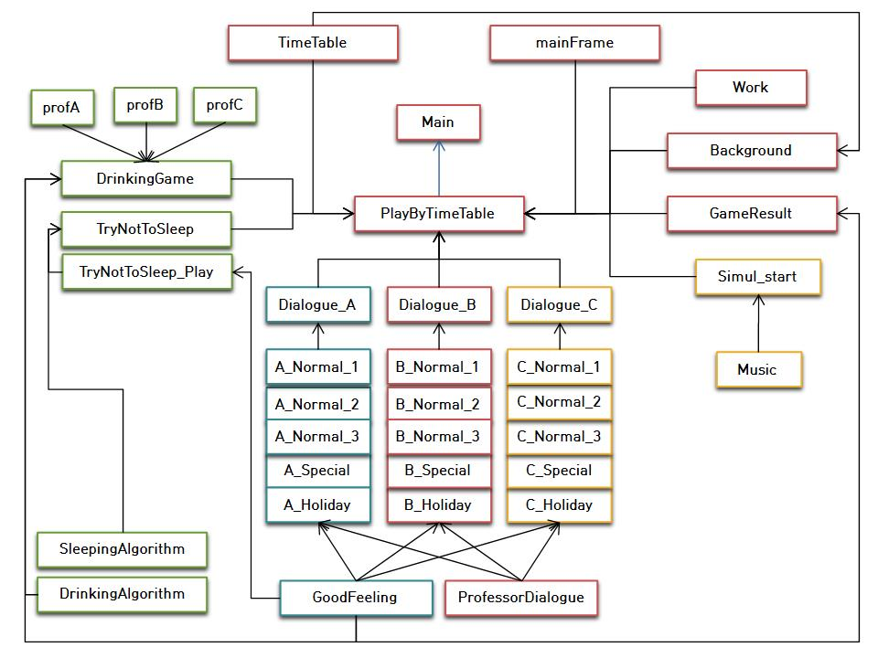  
 
  
  
사용한 개념
-----------
* 선택과 반복 (if-else, while, for...)
* 배열 (1, 2차원 배열)
* 클래스, 객체, 메소드
* String 클래스 활용
* 상속
* 그래픽 사용자 인터페이스 (GUI)
* 이벤트 처리, 그래픽 프로그래밍
* 오류 핸들링
* 스레드 활용
* 파일 입출력  
* 그외 기타 등등

게임 진행 화면 예시
-----------
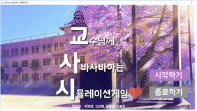 
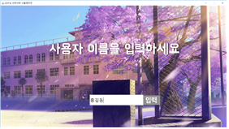 
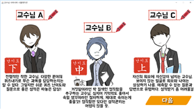  
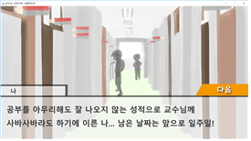 
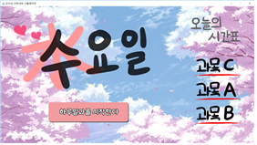 
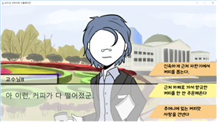  
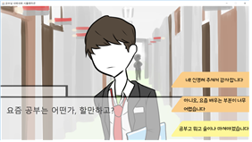 
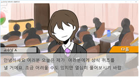 
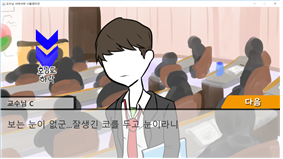  
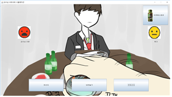 
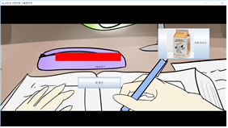 
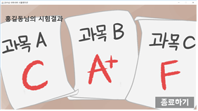  
 
